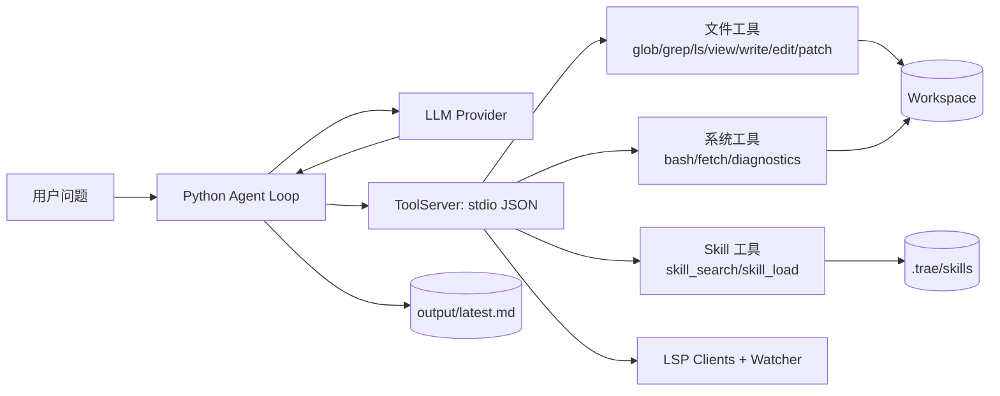
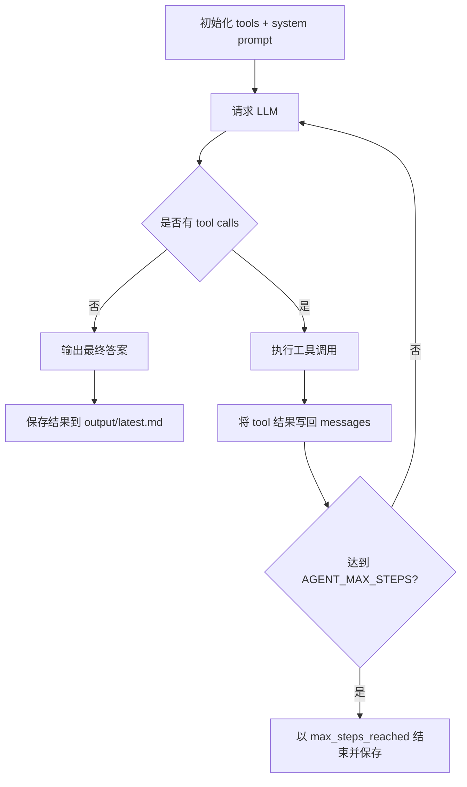
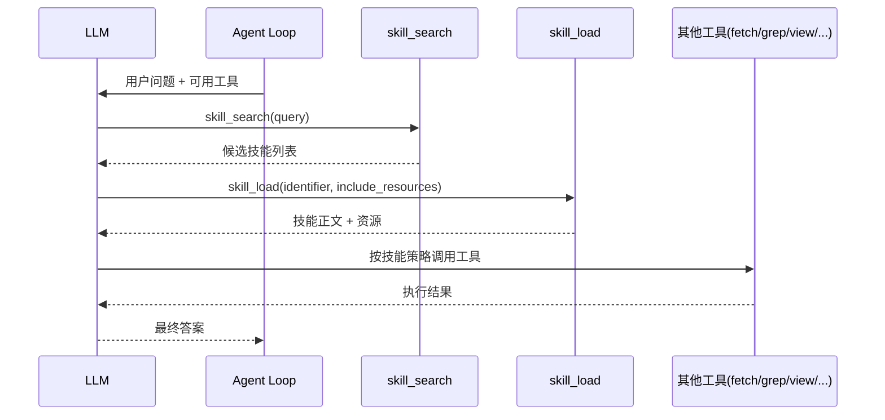

# demo-tools-bridge

把本地工具层（grep / glob / ls / view）用 Go 实现成一个可复用模块，并通过 stdio JSON 协议暴露为一个“tool server”。上层 agent 用 Python 作为子进程客户端调用这些工具。

## 项目简介

这个项目的目标很直接：把“会思考的 Agent”与“可控、可复用的本地工具能力”可靠地拼在一起。  
你可以把它理解成一个本地 Agent 基座：模型负责决策，工具负责执行，所有过程可观测、可追踪、可复盘。

它适合以下场景：
- 希望在本地代码仓里做自动化分析、检索与改写
- 需要把 LSP 诊断、文件读写、命令执行接入到统一工具协议
- 想把特定领域经验沉淀为 Skill，并让 Agent 按需检索和加载

## 主要功能

- **工具注册与统一调用**：通过 `list_tools/call_tool` 暴露工具能力，统一输入输出结构。
- **本地代码操作链路**：支持 `glob/grep/ls/view/write/edit/patch`，覆盖“查找-阅读-修改”的常见流程。
- **命令与网络能力**：支持 `bash` 执行命令、`fetch` 抓取网页或数据并转为 text/markdown/html。
- **LSP 诊断增强**：支持语言服务器接入、项目诊断读取与文件变更同步。
- **Skill 知识层**：支持 `skill_search` 检索技能、`skill_load` 加载正文与资源，形成“知识检索 + 工具执行”闭环。
- **Agent Loop 编排**：支持 step 循环、工具调用回填、最大步数限制、运行结果落盘。
- **运行可观测性**：输出 token 统计、工具活动轨迹、最终结果文件（`output/latest.md`）。

## 架构总览（图示）



## 目录结构

- `pkg/tools/`：可移植的底层工具实现（不依赖 opencode 的 internal 包）
- `cmd/toolserver/`：stdio JSON tool server（`list_tools` / `call_tool`）
- `python/agent_demo.py`：Python 上层示例（启动子进程 + 调用工具）

## 快速开始

### 1) 构建 toolserver

```bash
cd demo-tools-bridge
go build -o toolserver ./cmd/toolserver
```

### 2) 运行 Python demo

```bash
python ./python/agent_demo.py
```

默认会把工作目录设为本仓库根目录，并演示：
- 列出工具列表
- glob 查找 `**/*.go`
- grep 查找 `ToolInfo`
- ls 列出 `.` 的树
- view 读取 `go.mod`

## 设计现状（当前代码）

### 1) 架构分层

- **Go 工具服务层（核心）**：`cmd/toolserver/main.go` 通过 stdio 按行收发 JSON，请求方法为 `list_tools` / `call_tool`。
- **工具实现层**：`pkg/tools/` 提供 `glob / grep / ls / view / write / bash / diagnostics`，统一实现 `BaseTool` 接口并由 `Registry` 注册。
- **LSP 集成层**：`pkg/lsp/` 与 `pkg/lsp/watcher/` 负责启动语言服务器、初始化、诊断缓存、文件变更通知与 watcher 同步。
- **配置层**：`pkg/config/` 读取 `.opencode.json`，为 LSP 客户端提供可选配置。
- **Python 上层示例**：当前仅保留 `python/agent_demo.py`，作为进程客户端与模型侧编排示例。

### 2) 主流程（请求链路）

1. `toolserver` 启动时确定 `TOOLSERVER_ROOT`（为空则使用当前目录），并初始化 `Registry`。  
2. 尝试读取 `<root>/.opencode.json`，按配置启动可用 LSP 客户端。  
3. 对每个请求行做 JSON 反序列化并分发：  
   - `list_tools`：返回工具元信息（名称、参数 schema）。  
   - `call_tool`：按工具名执行并返回 `ToolResponse`。  
4. 所有响应统一为 `{id, result|error}` 结构，便于上层做 request-response 对齐。

### 3) 关键设计点

- **工作区边界控制**：工具侧通过 `absClean + isWithinRoot` 将访问约束在 workspace root 内，阻止越界路径读写。
- **LSP 增强读写体验**：`view` 可附带文件诊断，`write` 在文件已打开时触发 LSP `didChange`，`diagnostics` 可取文件级或项目级问题。
- **工具输出标准化**：统一返回 `ToolResponse{type, content, metadata, is_error}`，降低上层适配复杂度。
- **降级策略**：`glob/grep` 优先使用 `rg`，缺失或失败时退回 Go 实现。

### 4) 当前能力边界与现状判断

- **Go 侧能力完整度较高**：工具注册、协议处理、LSP 接入与 watcher 已形成闭环。
- **Python 侧处于示例态**：目前 `python/` 目录仅有 `agent_demo.py`，不再包含独立的 `codex_*` 封装模块。
- **结果形态偏“文本优先”**：工具 `content` 主要是面向阅读的文本，结构化字段主要放在 `metadata`。
- **并发模型偏简洁**：stdio 主循环串行处理请求，便于稳定性但未做工具级并发调度。

### 5) 已知风险/待补强点

- **协议扩展性**：当前方法集合固定为 `list_tools/call_tool`，尚未定义版本协商与 capability 协商机制。
- **权限模型粗粒度**：`bash` 工具可执行任意命令，依赖运行环境隔离；若用于多租户场景需补充命令白名单或策略引擎。
- **可观测性**：错误主要以文本回传，缺少统一错误码分层与调用链追踪字段。
- **Python 示例可运行性依赖外部模块**：`agent_demo.py` 中存在对 `codex_cli_provider` 的引用，实际集成前建议先补齐对应实现或改为纯工具服务演示模式。

## 开源项目说明

### 1) 技术栈

- **语言与运行时**：Go 1.23（工具服务与工具实现）、Python 3（Agent 编排与模型调用）。
- **通信协议**：toolserver 基于 stdio + JSON 行协议，支持 `list_tools` 与 `call_tool` 两个核心方法。
- **模型接口**：采用 OpenAI 兼容的 Chat Completions Tool Calling 形态，通过 `tools + tool_choice=auto` 让模型自动决策工具调用。
- **文件与代码检索**：`glob/grep/ls/view/write/edit/patch` 形成基础工具链，支持本地代码库巡检与修改。
- **诊断与编辑增强**：通过 `gopls` 等 LSP 客户端与 watcher 同步，实现诊断读取与编辑后状态刷新。
- **技能系统**：`.trae/skills/**/SKILL.md` 由 `skill_search/skill_load` 两类工具接入，实现可检索的任务知识层。
- **Skill 元数据机制**：Skill 文档支持 frontmatter（name/description），用于构建技能索引、检索排序与命中展示。
- **Skill 热更新机制**：基于 `fsnotify` 监听技能目录变更，支持索引刷新与运行期更新。
- **Skill 资源机制**：`skill_load(include_resources=true)` 可返回技能正文与同目录资源清单，便于一步加载“说明 + 素材”。
- **网络抓取能力**：`fetch` 工具支持 URL 拉取，并提供 text/markdown/html 输出，HTML 解析由 goquery + html-to-markdown 支撑。
- **关键依赖**：`doublestar`（glob 模式匹配）、`fsnotify`（文件系统事件）、`goquery`（HTML 解析）、`html-to-markdown`（内容转换）。

### 2) 项目优势

- **架构解耦清晰**：Go 侧专注“工具执行”，Python 侧专注“Agent 决策”，降低跨语言耦合与维护成本。
- **工具可复用性高**：所有工具统一 `BaseTool` 接口，新增工具只需注册即可被上层 Agent 复用。
- **安全边界明确**：通过 `absClean + isWithinRoot` 约束路径访问在 workspace 内，减少越界读写风险。
- **可观测性较强**：Agent loop 内置 step 级调试输出、token 统计、活动追踪与结果落盘（`output/latest.md`）。
- **扩展性友好**：支持 LSP、Skills、Fetch、Bash 等不同能力模块按需启用，适合演进为通用本地 Agent 基座。

### 3) 核心 Agent Loop（工作机制）

核心实现位于 `python/agent_demo.py` 的 `run_agent`，整体遵循“规划-调用-回填-再推理”闭环：

1. **初始化上下文**：读取工具列表，构建工具 schema，拼接 system prompt（工具名、中文能力说明、Skill 使用规则、写文件约束）。
2. **向模型请求下一步动作**：提交 `messages + tools`，获取 assistant 输出和 tool calls。
3. **终止判断**：若本轮无 tool calls，则直接将 assistant 内容作为最终答案并落盘。
4. **执行工具调用**：逐个执行模型返回的工具调用，把工具结果以 `role=tool` 写回消息历史。
5. **循环推进**：进入下一 step，直到得到最终答案或达到 `AGENT_MAX_STEPS` 上限。
6. **结果持久化**：成功、报错、超步数都会写入 `output/agent_result_*.md` 与 `output/latest.md`，便于追踪复现。



Skill 在 Agent Loop 中的典型链路如下：

1. **Skill 可用性探测**：启动后先检查工具集中是否包含 `skill_search` 与 `skill_load`。
2. **技能检索**：模型先调用 `skill_search(query)`，按相关性拿到候选技能（含名称、描述、路径等）。
3. **技能加载**：再调用 `skill_load(identifier, include_resources)` 获取技能正文与可选资源列表。
4. **策略执行**：模型将技能指令转化为后续 `fetch/grep/view/bash/...` 工具调用。
5. **闭环回写**：每次工具结果写回对话历史，模型据此继续推理，直至输出最终答案。



### 4) 开源准则（本项目建议与当前实践）

- **许可证准则**：项目采用 MIT License，允许商用、修改、分发，但必须保留版权与许可声明。
- **依赖合规准则**：引入第三方库时需确认许可证兼容性，并在发布时保留必要归属信息。
- **安全准则**：禁止提交密钥、令牌、凭据；遵守最小权限原则，避免在不可信环境直接开放 `bash` 能力。
- **边界准则**：默认只在工作区内读写，避免越权访问；变更应可审计、可回滚。
- **透明准则**：对工具失败、模型失败、超步数等状态要可见并可复盘，避免“静默失败”。

### 5) 借鉴的开源思路

- **OpenCode 系工具分层思路**：保留“工具实现层 + server 暴露层 + 上层 agent 编排层”的解耦模式，并通过 `.opencode.json` 兼容 LSP 配置入口。
- **OpenAI 兼容 Tool Calling 思路**：沿用 `chat/completions + tools/function` 的标准交互，使模型提供方可替换。
- **Unix 生态工具思路**：优先复用 `ripgrep` 等成熟工具能力，失败时回退到纯 Go 实现，兼顾性能与可移植性。
- **开源组件组合思路**：使用 `fsnotify`、`doublestar`、`goquery`、`html-to-markdown` 等社区成熟库，减少重复造轮子并提升稳定性。
