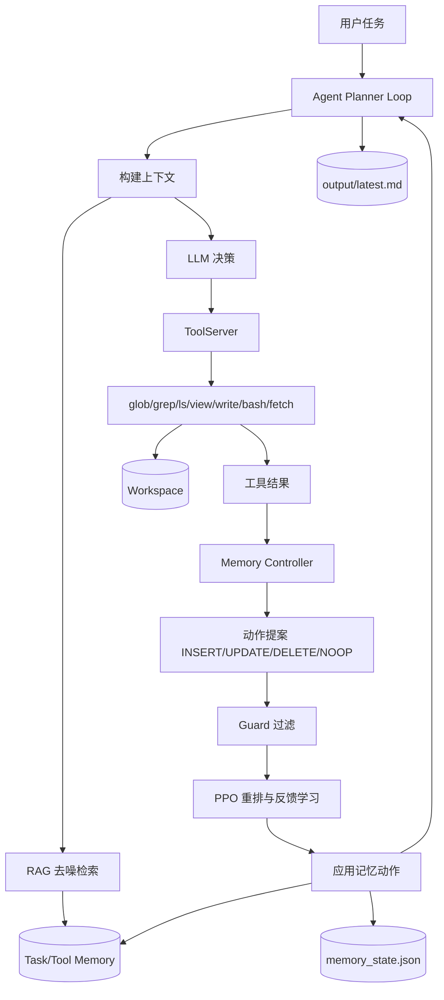
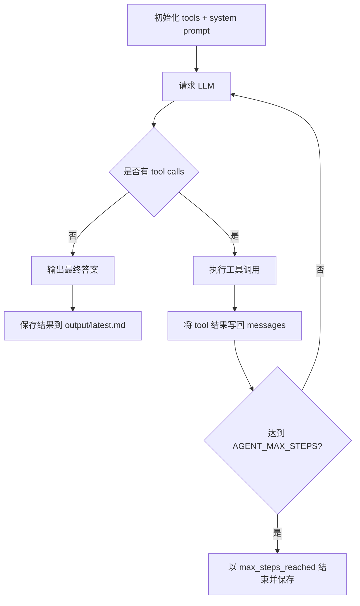
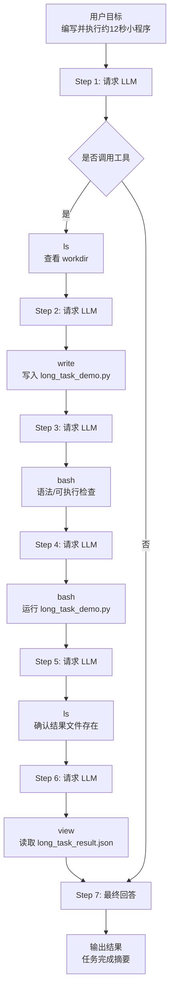
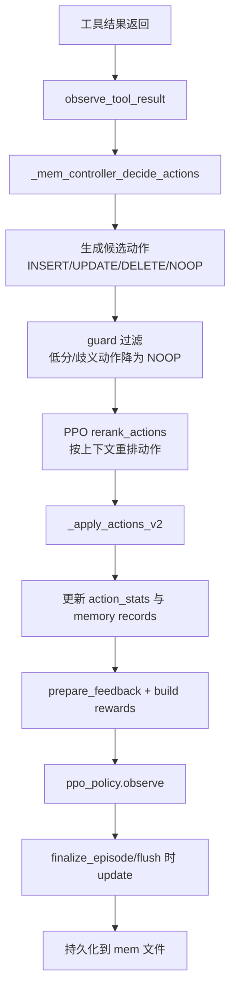
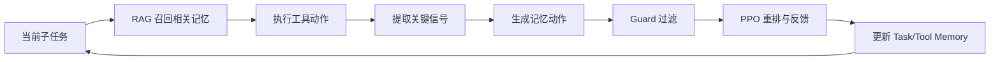

<p align="center">
  
</p>

<h1 align="center">demo-tools-bridge / AUTO-MVP</h1>

<div align="center">


</div>

<div align="center">

本地可控的 Agent 基座：模型负责决策，工具负责执行，过程可观测、可追踪、可复盘。  
支持 Tool Calling、RAG 去噪检索、Memory 动态更新与 PPO 反馈策略。

</div>

---

## 📖 导航

[✨ 主要功能](#-主要功能) • [🏗️ 架构总览](#-架构总览) • [🔁 核心流程](#-核心流程与任务示例) • [🧬 最新能力实现](#-auto-mvp-最新能力实现memoryppo-rag) • [🧠 设计现状](#-设计现状当前代码) • [🚀 快速开始](#-快速开始)

---

## 📖 项目简介

这个项目的目标很直接：把“会思考的 Agent”与“可控、可复用的本地工具能力”可靠地拼在一起。  
你可以把它理解成一个本地 Agent 基座：模型负责决策，工具负责执行，并通过 **RAG 检索 + Memory 动态更新 + PPO 策略优化** 持续提升长任务稳定性。

核心机制（面向长复杂任务）：
- **RAG 去噪检索**：语义相似度 + 词法重叠融合召回，优先命中高价值历史记忆，减少无关上下文干扰。
- **记忆动态更新**：对任务过程中的关键信息执行 `INSERT/UPDATE/DELETE`，并通过 guard 机制抑制低置信修改。
- **PPO 反馈学习**：根据动作效果对记忆操作策略进行重排与优化，让 Agent 在多步骤任务中越跑越稳、越跑越准。

适用场景：
- 希望在本地代码仓里做自动化分析、检索与改写
- 需要把检索增强、文件读写、命令执行接入到统一工具协议
- 需要在长链路任务中持续修正策略，让 Agent 随任务推进不断提升成功率

---

## ✨ 主要功能

- **工具注册与统一调用**：通过 `list_tools/call_tool` 暴露工具能力，统一输入输出结构。
- **本地代码操作链路**：支持 `glob/grep/ls/view/write/edit/patch`，覆盖“查找-阅读-修改”的常见流程。
- **RAG 去噪检索**：语义相似度 + 词法重叠 + 动态阈值过滤，降低噪声召回。
- **记忆动态更新**：task/tool 双域记忆 + `INSERT/UPDATE/DELETE` + guard 安全过滤。
- **PPO 策略优化**：对记忆动作进行重排、反馈学习和在线更新，提升长任务成功率。
- **Agent Loop 编排**：step 循环、工具结果回填、最大步数保护与结果落盘。
- **过程可观测性**：输出 token、策略统计与运行轨迹，支持复盘调优。

---

## 🏗️ 架构总览



---

## 🔁 核心流程与任务示例

### 1) 核心 Agent Loop（工作机制）

核心实现位于 `python/agent_demo.py` 的 `run_agent`，整体遵循“规划-调用-回填-再推理”闭环：

1. **初始化上下文**：读取工具列表，构建工具 schema，拼接 system prompt（工具约束、写文件规则、执行边界）。
2. **向模型请求下一步动作**：提交 `messages + tools`，获取 assistant 输出和 tool calls。
3. **终止判断**：若本轮无 tool calls，则直接将 assistant 内容作为最终答案并落盘。
4. **执行工具调用**：逐个执行模型返回的工具调用，把工具结果以 `role=tool` 写回消息历史。
5. **循环推进**：进入下一 step，直到得到最终答案或达到 `AGENT_MAX_STEPS` 上限。
6. **结果持久化**：成功、报错、超步数都会写入 `output/agent_result_*.md` 与 `output/latest.md`，便于追踪复现。



### 2) 小程序任务（Agent Loop Demo）流程图



### 3) PPO 相关流程图（记忆动作策略更新）



### 4) 长任务闭环（RAG × Memory × PPO）



---

## 🧬 AUTO-MVP 最新能力实现（Memory/PPO/RAG）

### 1) Memory 动态更新（按 tool/task 分域）

- **决策入口**：`observe_tool_result` 在工具成功返回后触发 `_mem_controller_decide_actions`，将工具结果切片、构建候选记忆并生成动作集合（`INSERT/UPDATE/DELETE/NOOP`）。
- **作用域管理**：`_resolve_scope` + `_select_records` 将记忆拆分为 `task` 与 `tool` 两个桶，`tool` 记忆按 `tool_name` 隔离，避免跨工具污染。
- **动作落地**：`_apply_actions_v2` 支持按引用更新 task/tool 两类记录，执行后统一 `_trim_overflow` 保持容量上限。
- **安全守卫**：`_guard_actions_v2` 会把低置信、歧义、低一致性的 `UPDATE/DELETE` 降级为 `NOOP`，减少错误覆盖与误删。

```python
def _mem_controller_decide_actions(...):
    guarded_actions, guard_meta = self._guard_actions_v2(...)
    action_feedback = self.ppo_policy.prepare_feedback(guarded_actions, context=guarded_context)
    changed = self._apply_actions_v2(guarded_actions, candidate_ref_map, source=f"tool:{tool_name}")
```

### 2) PPO 策略（动作重排 + 在线反馈）

- **重排机制**：`rerank_actions` 将候选动作按类型分数与检索分数融合，生成 `position_prob`，并选择 top-k 动作执行，未入选动作自动替换为 `NOOP`。
- **反馈采样**：`prepare_feedback` 提取动作类型、旧 log prob、特征、value 估计；`_build_policy_rewards` 用变更结果与 guard 信息构造 reward。
- **在线观察**：每个动作通过 `ppo_policy.observe` 写入 buffer，随后在 `flush/update` 时进行 PPO 更新。
- **稳定训练**：策略内置 `advantage_normalize`、`advantage_clip`、`target_kl`、`vf_clip` 等约束，降低训练振荡。

```python
self.ppo_policy.observe(
    str(item.get("action_type") or ""),
    float(item.get("old_log_prob") or 0.0),
    reward,
    done=False,
    features=item.get("features"),
    value_estimate=item.get("value_estimate"),
)
```

### 3) RAG 去噪（语义 + 词法 + 动态阈值）

- **双路相似度**：检索阶段同时计算 `_memory_cosine_similarity`（向量语义）与 `_memory_overlap_score`（词法重叠）。
- **融合排序**：`_rank_records` 使用 `semantic*0.74 + lexical*0.14 + focus*0.12` 融合得分，并叠加命中次数和时间衰减。
- **动态截断**：通过 `dynamic_floor = max(min_score, top*0.72, mean+std*0.20)` 自动过滤噪声候选，避免固定阈值在不同任务上失效。
- **工具专用检索**：`retrieve_toolmem` 对 tool bucket 独立召回，优先使用同工具历史经验。

```python
semantic = _memory_cosine_similarity(query_embedding, record.retrieval_embedding)
lexical = _memory_overlap_score(query_tokens, record.tokens)
score = semantic * 0.74 + lexical * 0.14 + focus_overlap * 0.12
```

### 4) 持久化（记忆与策略状态可恢复）

- **落盘内容**：`MemSkillLocalMemoryBank._serialize` 持久化 `records/task_records/tool_records/actions/ppo_policy`。
- **写入方式**：`_save_to_file` 采用 `tmp + os.replace` 原子替换，避免异常中断导致文件损坏。
- **恢复路径**：`_load_from_file` 启动时恢复 task/tool 记忆及 `ppo_policy`，保证长任务可连续学习。

```python
def _save_to_file(self) -> None:
    temp_path = self.storage_path + ".tmp"
    with open(temp_path, "w", encoding="utf-8") as f:
        json.dump(self._serialize(), f, ensure_ascii=False, indent=2)
    os.replace(temp_path, self.storage_path)
```

---

## 🧠 设计现状（当前代码）

### 1) 架构分层

- **Go 工具服务层（核心）**：`cmd/toolserver/main.go` 通过 stdio 按行收发 JSON，请求方法为 `list_tools` / `call_tool`。
- **工具实现层**：`pkg/tools/` 提供 `glob / grep / ls / view / write / bash / diagnostics`，统一实现 `BaseTool` 接口并由 `Registry` 注册。
- **记忆策略层（核心增量）**：`python/agent_demo.py` 内置 Memory Controller、PPOActionPolicy 与 RAG 去噪召回逻辑。
- **配置层**：环境变量控制记忆阈值、PPO 超参数、chunk/fusion 策略，支持任务级快速调优。
- **Python 上层示例**：当前仅保留 `python/agent_demo.py`，作为进程客户端与模型侧编排示例。

### 2) 主流程（请求链路）

1. `toolserver` 启动时确定 `TOOLSERVER_ROOT`（为空则使用当前目录），并初始化 `Registry`。  
2. 初始化记忆库、PPO 策略参数与检索融合参数（阈值、top-k、clip、target_kl 等）。  
3. 对每个请求行做 JSON 反序列化并分发：  
   - `list_tools`：返回工具元信息（名称、参数 schema）。  
   - `call_tool`：按工具名执行并返回 `ToolResponse`。  
4. 所有响应统一为 `{id, result|error}` 结构，便于上层做 request-response 对齐。

### 3) 关键设计点

- **工作区边界控制**：工具侧通过 `absClean + isWithinRoot` 将访问约束在 workspace root 内，阻止越界路径读写。
- **RAG 去噪召回**：语义相似度 + 词法重叠 + focus overlap 融合排序，并使用动态阈值过滤低质量候选。
- **工具输出标准化**：统一返回 `ToolResponse{type, content, metadata, is_error}`，降低上层适配复杂度。
- **降级策略**：`glob/grep` 优先使用 `rg`，缺失或失败时退回 Go 实现。

### 4) 当前能力边界与现状判断

- **Go 侧能力完整度较高**：工具注册、协议处理、执行链路与安全边界已形成闭环。
- **Python 侧聚焦单文件演进**：核心策略集中在 `agent_demo.py`，便于快速迭代但模块化仍可继续加强。
- **结果形态偏“文本优先”**：工具 `content` 主要是面向阅读的文本，结构化字段主要放在 `metadata`。
- **并发模型偏简洁**：stdio 主循环串行处理请求，便于稳定性但未做工具级并发调度。

### 5) 已知风险/待补强点

- **协议扩展性**：当前方法集合固定为 `list_tools/call_tool`，尚未定义版本协商与 capability 协商机制。
- **权限模型粗粒度**：`bash` 工具可执行任意命令，依赖运行环境隔离；若用于多租户场景需补充命令白名单或策略引擎。
- **可观测性**：错误主要以文本回传，缺少统一错误码分层与调用链追踪字段。
- **策略可解释性**：已具备统计指标，但动作级解释与可视化面板仍可补强。

---

## 🚀 快速开始

### 1) 构建 toolserver

```bash
go build -o toolserver ./cmd/toolserver
```

### 2) 运行 Agent Demo

```bash
python ./python/agent_demo.py
```

---

## 📂 目录结构

- `cmd/toolserver/`：stdio JSON tool server（`list_tools` / `call_tool`）
- `pkg/tools/`：可复用的底层工具实现（glob/grep/ls/view/write/bash/diagnostics）
- `train/`：训练数据与策略统计产物
- `pkg/config/`：项目配置读取（含 `.opencode.json`）
- `python/agent_demo.py`：Python 上层 Agent Loop 示例
- `output/`：运行产物与任务结果落盘目录

---

## 📚 核心优势总结

- **长任务更稳**：RAG 去噪检索先筛信息，减少上下文污染和错误路径扩散。
- **记忆可进化**：Memory Controller 持续执行更新/合并/删除，让状态始终贴近当前任务。
- **策略会学习**：PPO 对动作结果做在线反馈，逐步提高有效操作比例。
- **工程可控**：本地工具链 + 工作区边界 + 结果落盘，方便审计、复现与调优。
